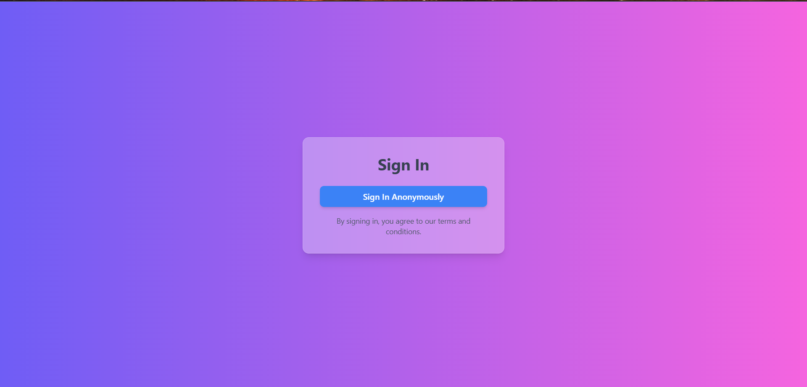
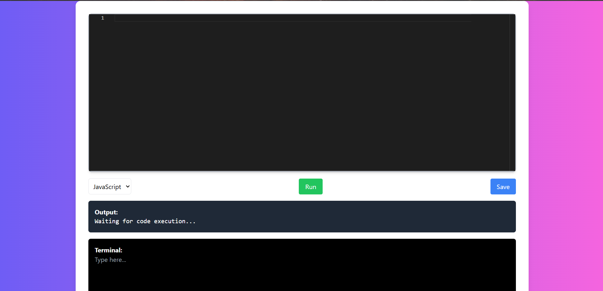

# Collaborative Code Editor

A real-time collaborative code editor built using **Node.js**, **Socket.io**, and **Monaco Editor**.

This project allows multiple users to edit code together live and run their code on the server. It supports basic JavaScript and Python execution.

---

## 🚀 Features

- Live real-time collaborative editing using **Socket.io**
- Syntax highlighting and IntelliSense powered by **Monaco Editor**
- Execute JavaScript and Python code from the editor
- Save code files locally
- Simple and clean UI

---

## 🛠 Tech Stack
### Frontend:
- HTML5
- CSS3
- Tailwind CSS (for responsive and modern UI)
- JavaScript
- Monaco Editor (code editor component)

### Backend:
- Node.js
- Express.js (web server framework)
- Socket.io (real-time communication)
- Child Process Module (to run code on server)

### Others:
- npm (Node Package Manager)
- VS Code (for development)


---

## 📁 Project Structure

collaborative-code-editor/ 
├── .idea/ # IDE settings (ignore this in GitHub usually) 
├── node_modules/ # Installed npm packages (should be in .gitignore) 
├── public/ 
  │ 
  ├── index.html # Frontend HTML 
  │ 
  ├── script.js # Frontend JavaScript logic 
  │ 
  └── style.css # Frontend styles
├── package.json # Project metadata and dependencies 
├── package-lock.json # Dependency lock file 
├── server.js # Backend server (Node.js + Socket.io)

---

## 🔥 Installation and Running the Project

### 1. Clone the repository
```bash
git clone https://github.com/your-username/collaborative-code-editor.git
cd collaborative-code-editor
```
### 2. Install dependencies
```bash
npm install
```
### 3. Run the server
```bash
node server.js
```
### 4. Open the browser
Go to http://localhost:3000

---

## 🖼️ Screenshots



---

## ⚙️ Future Improvements
- Support for more languages (C, Java, etc.)
- User authentication (sign-in / sign-up)
- Multiple separate rooms for editing
- Real-time terminal output
- Better error handling and code execution security

---

## ✨ Acknowledgments
- Monaco Editor
- Socket.io
- Node.js

---

